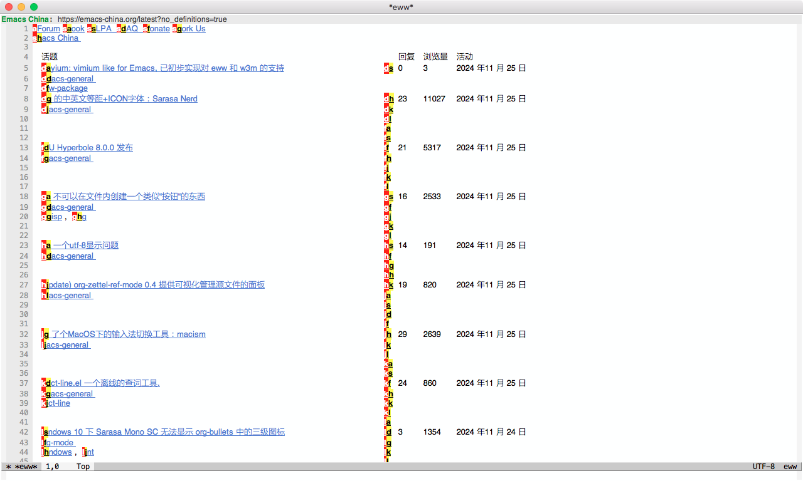

<!-- This file was generated from elisp commentary section by tool, DO NOT EDIT -->
<!-- Generated at: 2024-11-26 12:07:46 +0800 -->

# Avyium

[Vimium](https://github.com/philc/vimium) like for Emacs based on [avy](https://github.com/abo-abo/avy).



## Requirements

- Emacs 28.1+
- Avy 0.5+

## Installation

- Manual

Clone this repository to `/path/to/avyium/`.  Add the following to your configuration file:

``` elisp
(add-to-list 'load-path "/path/to/avyium/")
(require 'avyium)
```

- Quelpa

``` elisp
(quelpa '(avyium :fetcher github
                 :repo "twlz0ne/avyium"
                 :files ("avyium.el")))
```

